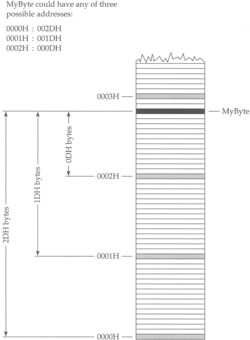

What's this?
-----
A demonstration on how to set the CPU in ["un-real mode"](https://wiki.osdev.org/Unreal_Mode) and access the
linear frame buffer of the video card (requires [VBE](https://en.wikipedia.org/wiki/VESA_BIOS_Extensions) 2.0 
or higher compatibility) to draw a gradient while still being in [real-mode](https://wiki.osdev.org/Real_Mode). 

Why
------
**Short answer**\
Just for fun, by an old DOS programmer.

**Long answer**\
To anyone who's unfamiliar with PC history, accessing 4GB of flat memory in real-mode doesn't sound 
like a big deal. So here follows a short history lesson of struggles of legacy PC programming, Up until 
the mid 90s DOS was quite common still. Real-mode DOS ran in a horrendous memory model where data and 
code were addressed using a segment and an offset. Within each segment you could address 64KB of data 
using the offset `0000:ffffh`, however, the segments were also overlapping every 16 bytes (paragraph). 
As illustrated by the figure below ([courtesy of](http://www.c-jump.com/CIS77/ASM/Memory/lecture.html)). 

 

Using this segmented model you could in total access 1MB of memory in a very convoluted way. To 
access any more than that you had to use memory banking where special hardware (i.e 
[VESA Bios Extensions](https://web.archive.org/web/20120328134352/http://www.opferman.net/Text/svga.txt)) 
or by using Expanded Memory Emulators [EMS](https://en.wikipedia.org/wiki/Expanded_memory).

Those were the struggles faced by DOS programmers. On a 386 or better, it is possible to 
use a 32 bit register as offset as demonstrated below. 

```nasm
    push    word 0a000h
    pop     es
    xor     edi, edi

.loop:
    mov     al, es:edi
    inc     edi
    cmp     edi, 0ffffh
    jl      .loop
```

As long as your offset is within the range `0000:ffffh`, anything above that will cause 
[general protection fault](https://en.wikipedia.org/wiki/General_protection_fault). Un-real 
mode/big real mode hacks the CPU to let us any offset between 0-4GB without having to run
actual 32-bit code in protected mode. Thereby letting us access the VBE linear frame buffer
and anything that was never possible in real mode DOS.

Any (probably) real-mode DOS programs/tools will (probably) still work without any issues. 
For instance, QuickBasic, TurboPascal and what not.  

Caveats
------
 - Won't work in [V86](https://en.wikipedia.org/wiki/Virtual_8086_mode) mode. That means EMS emulator 
   is loaded or under Windows.
 - Instructions such as rep movs/stos only use 16 bit offsets in real mode.
 

How to run
------
For convenience gradient.asm is written in [MASM](https://en.wikipedia.org/wiki/Microsoft_Macro_Assembler) 
syntax but is easy to port to NASM/FASM. 

To compile (using MASM 6.11 or higher)

`ml gradient.asm`

The most convenient wy to run would likely be through [DOSBox](https://www.dosbox.com/). To launch
in the DOS command prompt, type

`gradient.com` 

You should see the following output


